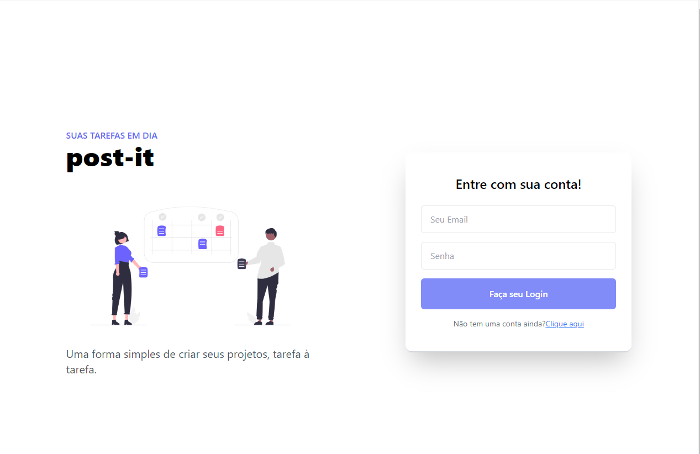
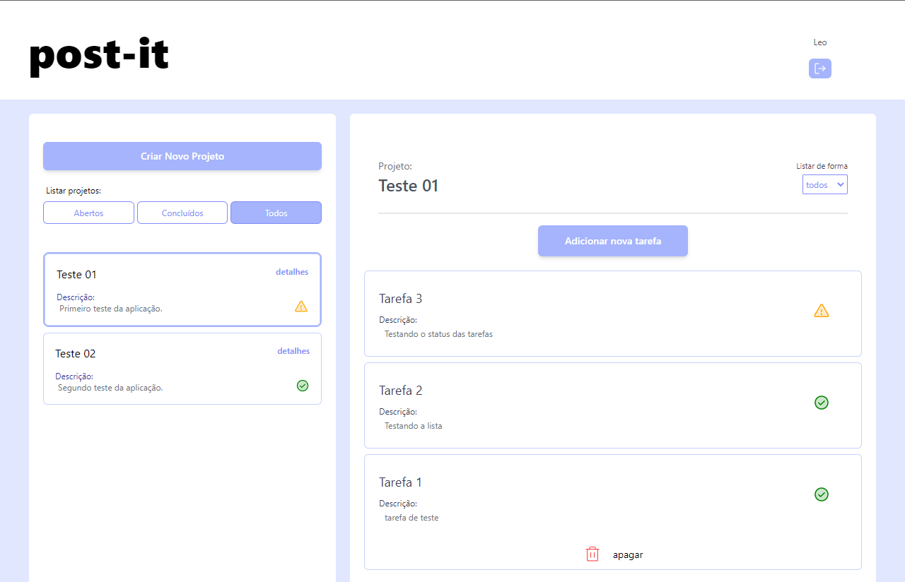

 

[LINK DO PROJETO NO VERCEL](https://my-post-it.vercel.app/)

 

  
   

## 🚀 Tecnologias

Esse projeto foi desenvolvido com as seguintes tecnologias:

- ReactJS
- TypeScript
- Vite
- Tailwind
- Prisma

Bibliotecas
- Phosphor
- React-router-dom
- Axios
 
Ferramentas
- [Vercel](https://vercel.com/) - front-end
- [Railway](https://railway.app/) - back-end

## 💻 Projeto

Post-it é uma aplicação onde o usuário pode controlar seus projetos com tarefas criadas por ele mesmo.

Desenvolvido por Leords.
